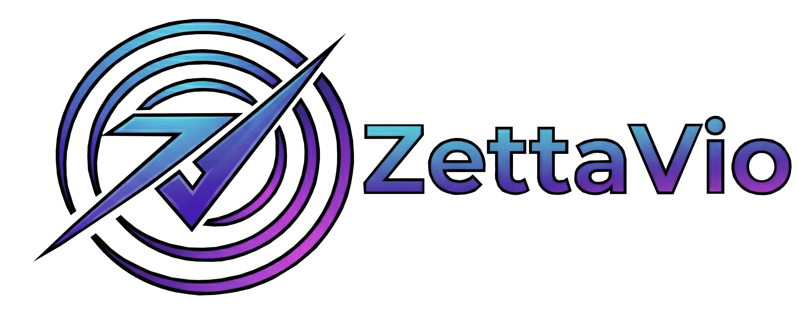

# 🧭 Zetta Vío: Movilidad Inteligente y Seguridad Ciudadana

**Zetta Vío** es un asistente de movilidad inclusiva diseñado para el reto **CiberGu 2026**. Nuestra misión es transformar la experiencia de transporte público en Guadalajara, ofreciendo una herramienta potente, humana y segura para personas con discapacidad visual y ciudadanos en general.

## 🚀 Funcionalidades Principales

### 🚌 1. Asistente de Tiempos Real-Time
Consulta de tiempos de llegada de autobuses de Guadalajara mediante procesamiento de lenguaje natural. 
- **Tecnología**: Web Scraping avanzado (Playwright) sobre el portal oficial de ALSA.
- **Voz Natural**: Conversión de abreviaturas técnicas a lenguaje humano comprensible.

### 🧭 2. Modo Lazarillo (Navegación Vocal)
Guía paso a paso al usuario desde su ubicación actual hasta la parada elegida.
- **Tecnología**: Integración con las APIs de **Google Maps (Routes API V2)**.
- **Seguridad**: Sistema de rastreo por GPS con confirmación de llegada mediante vibración y audio.

### 🆘 3. Protocolo SOS CarePing
Sistema de emergencia de alta prioridad para situaciones de peligro o caídas.
- **Activación por Voz**: El usuario puede activar la alerta gritando "¡Socorro!" o "¡Ayuda!".
- **Notificación Instantánea**: Envío de alerta con ubicación exacta, nivel de batería y enlace a Google Maps a servicios de emergencia vía **Telegram**.
- **Seguridad Criptográfica**: Mensajes validados mediante firmas HMAC para prevenir ataques de suplantación.

## 🛠️ Arquitectura Técnica

- **Backend**: Python con **FastAPI** (Rápido, moderno y seguro).
- **Frontend**: Single Page Application (SPA) con **Vanilla JS** y **CSS3** (Aesthetics Premium).
- **Geolocalización**: Google Geocoding y Google Routes API.
- **Notificaciones**: Telegram Bot API.
- **Seguridad**: Rate Limiting y Validación de firmas SHA256.

## 📦 Estructura del Proyecto

- `/webapp`: Interfaz de usuario, estilos y lógica de voz del cliente.
- `/python_service`: Servidor API de alta disponibilidad y lógica de extracción de datos.
- `/python_service/core`: Motores de scraping y utilidades de geolocalización.

---
*Proyecto desarrollado para el Reto CiberGu 2026 - Guadalajara, España.*
